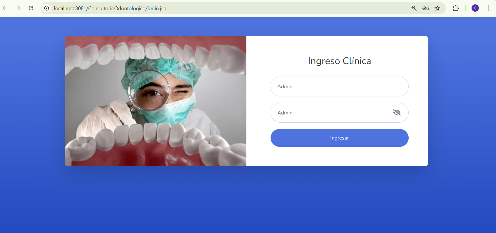
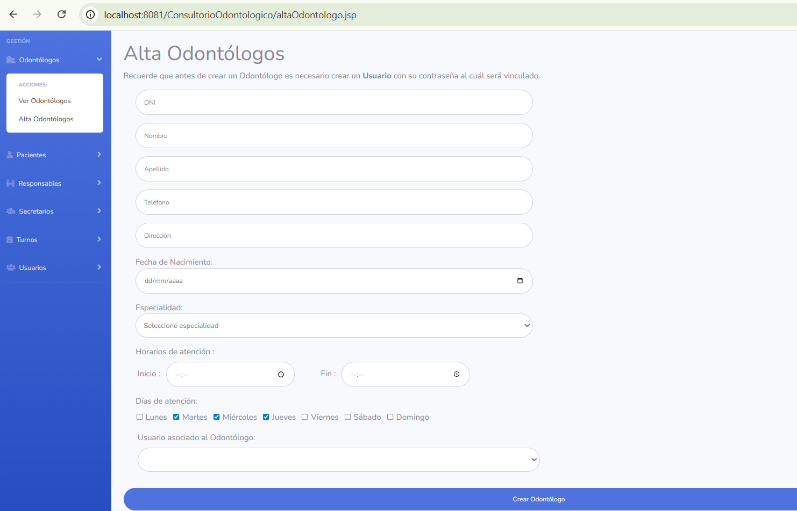
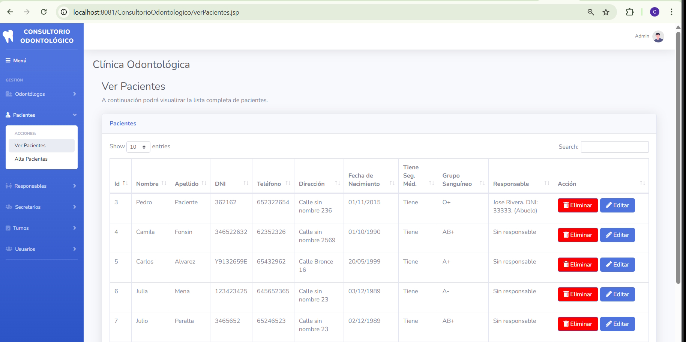
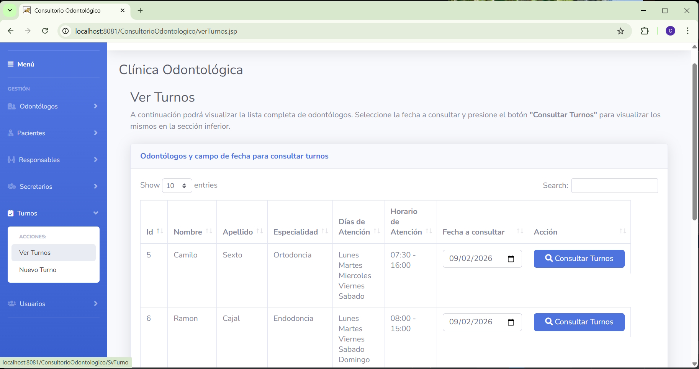
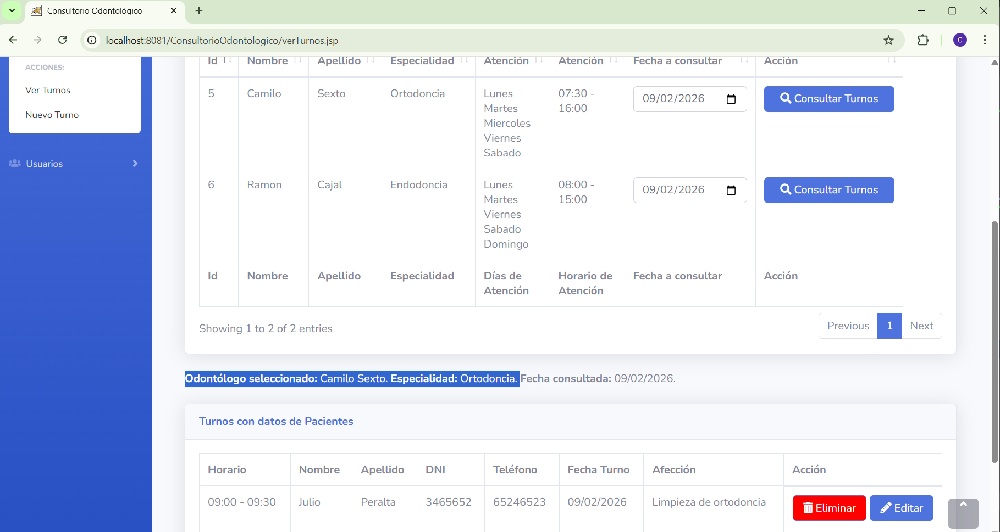

# Consultorio Odontológico – Aplicación Web Java EE

Este proyecto corresponde a un **Trabajo Práctico Integrador** orientado al desarrollo de aplicaciones web dinámicas utilizando **Java EE**, **Servlets** y **JSP**.

Se trata de una **aplicación web para la gestión integral de una clínica odontológica**, permitiendo administrar pacientes, odontólogos, secretarios y turnos, respetando horarios de atención, especialidades y control de acceso por usuario.

El sistema fue desarrollado comprendiendo la **arquitectura cliente-servidor**, el manejo de **peticiones HTTP**, el **control de sesiones**, la **persistencia de datos** y el **ciclo completo de una aplicación web** desplegada en un servidor de aplicaciones.

---

## Tecnologías utilizadas

- Java EE  
- Servlets  
- JSP  
- Maven (gestión de dependencias)  
- JPA (persistencia de datos)  
- Hibernate  
- Apache Tomcat  
- HTML / CSS  
- MySQL (base de datos)

---

## Descripción general del sistema

La aplicación permite administrar una clínica odontológica que cuenta con:

- Pacientes (mayores y menores de edad)
- Responsables legales para pacientes menores
- Odontólogos con distintas especialidades
- Secretarios/as que gestionan la operatoria diaria
- Turnos médicos asignados según disponibilidad y especialidad

El sistema incluye **login y control de acceso**, siendo utilizado principalmente por los/as secretarios/as, aunque los odontólogos también pueden acceder para visualizar y gestionar sus turnos.

---

## Funcionalidades principales

### Gestión de usuarios

- Login con usuario y contraseña
- Control de sesiones

### Secretarios

- Crear, editar, listar y eliminar secretarios
- Gestión general del sistema

### Odontólogos

- Crear, editar, listar y eliminar odontólogos
- Asignación de especialidades
- Definición de días y horarios de atención
- Visualización de turnos asignados por día

### Pacientes

- Registro de pacientes con datos personales
- Identificación de pacientes con o sin seguro médico
- Registro del tipo de tratamiento o motivo de consulta
- Asignación de responsable en caso de pacientes menores de edad
- Visualización y ordenamiento de pacientes desde la interfaz

### Turnos

- Creación, edición y eliminación de turnos
- Asignación de turnos según:
  - Especialidad del odontólogo
  - Días y horarios de atención disponibles
- Validación automática:
  - No permite asignar turnos fuera del horario laboral del odontólogo
  - Muestra advertencias ante intentos inválidos
- Visualización de turnos por odontólogo y por día seleccionado

---

## Arquitectura y conceptos aplicados

- Arquitectura **Cliente – Servidor**
- Manejo de peticiones **HTTP (GET / POST)**
- Control de sesiones con `HttpSession`
- Persistencia de datos con **JPA**
- Separación de responsabilidades:
  - Capa de presentación (JSP)
  - Capa de control (Servlets)
  - Capa de persistencia (JPA / Hibernate)
- Gestión de dependencias con **Maven**
- Despliegue en **Apache Tomcat**

---

## Ejecución del proyecto

### Ejecución en local

1. Clonar el repositorio:

 - git clone https://github.com/ChristianQ90/ConsultorioOdontologico.git

2. Importar el proyecto en el IDE (IntelliJ / Eclipse / NetBeans) como proyecto Maven.

3. Configurar la base de datos MySQL y los datos de conexión en el archivo de persistencia correspondiente.

4. Configurar Apache Tomcat en el IDE.

3. Ejecutar el proyecto y acceder desde el navegador a:

 - http://localhost:8081/ConsultorioOdontologico

---

## Comentario final

Este proyecto tiene como objetivo aplicar de manera práctica los conceptos fundamentales de Java EE, abarcando desde la gestión de usuarios y sesiones hasta la persistencia de datos y el despliegue de una aplicación web completa.

El desarrollo busca reflejar un escenario realista, contemplando validaciones, control de accesos y reglas de negocio propias de una clínica odontológica.

---

## Capturas de la aplicación

### Login y control de acceso

### Gestión de Odontólogos

### Gestión de pacientes

### Gestión de turnos

### Turnos por odontólogo
